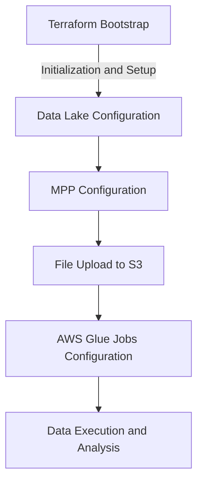

# Terraform AWS Resource Creation Guide

This guide outlines the steps and architecture for setting up Terraform resources to achieve the objectives of our AWS project. It includes the setup for Terraform bootstrap, Data Lake configuration, and MPP (Massively Parallel Processing) jobs.

## Workflow Overview

The execution of the Terraform folders follows a specific sequence to ensure the proper setup of the AWS infrastructure. It is crucial to adhere to this order:

1. **bootstrap**: This is the initial step. It involves setting up the foundational elements needed for the rest of the Terraform deployment. This step includes the creation of the Terraform state bucket, DynamoDB for state locking, and the setup of a service user for CI execution.

2. **datalake**: After successfully setting up the initial Terraform environment, the next step is to configure the Data Lake. This involves creating and managing S3 buckets for raw, staged, and analytics data, and setting up lifecycle rules and access controls.

3. **mpp**: The final step is configuring the Massively Parallel Processing (MPP) setup. This includes setting up AWS Glue jobs for data processing and managing the upload of local files to S3.

The sequence of these steps is crucial for a successful deployment. Each folder's setup builds upon the previous, ensuring a smooth and error-free progression. Below is a visual representation of this workflow:

## C4 Architecture Model

### Level 1: System Context Diagram

Shows the overall system in relation to external entities (users, external systems).

- **System**: Terraform AWS Infrastructure.
- **External Entities**: AWS Services, Terraform Registry, CI/CD Pipelines, Data Sources.

### Level 2: Container Diagram

Details the high-level technology choices, how they interact, and their roles.

- **Containers**:
  - Terraform Configuration Files.
  - S3 Buckets (for Terraform State and Data Lake).
  - AWS Glue (for Data Processing).
  - DynamoDB (for Terraform Locking).

### Level 3: Component Diagram

Dives into a specific container (e.g., Terraform Configuration) to detail components.

- **Components in Terraform Configuration**:
  - State Management Setup.
  - IAM Roles and Policies.
  - S3 Bucket Configurations.
  - AWS Glue Job Scripts.

## Folder Structure and READMEs

The project is organized into three main folders, each with a specific purpose:

1. **bootstrap**: Contains Terraform configurations for initial setup, such as state bucket creation, DynamoDB for state locking, and service user creation.

   - *README*: Detailed instructions for initializing the Terraform environment, prerequisites, and step-by-step execution guidance.

2. **datalake**: Orchestrates the Data Lake setup, managing S3 buckets for raw, staged, and analytics data, and configuring lifecycle rules and access controls.

   - *README*: Instructions for setting up and managing the Data Lake, including S3 bucket configurations and security considerations.

3. **mpp**: Focuses on setting up AWS Glue jobs for data processing, including the upload of local files to S3 and Glue crawler configurations.

   - *README*: Guide to configuring and executing AWS Glue jobs, managing dependencies, and handling data processing tasks.

## Future Steps and Best Practices

### Implementation of AWS Lake Formation

- **Objective**: To enhance data governance and security within the Data Lake.
- **Benefits**: Even for cases involving public data, as in this project, implementing Lake Formation adds an extra layer of security and compliance. This is crucial for protecting sensitive data and ensuring adherence to data privacy regulations.

### Implementation of a Private Network for AWS Glue Jobs

- **Objective**: To run AWS Glue jobs within a private network.
- **Benefits**: This approach significantly boosts the security of data processes by minimizing exposure to external threats. Although the data processed in this case is public, in a production environment, using a private network is a recommended practice to ensure data security and integrity.

### Segregation of Resources Across Multiple Repositories

- **Objective**: To divide Terraform resources across multiple repositories.
- **Benefits**: In production environments, it is vital to separate the creation and permission management of cloud resources. This segregation improves organization, security, and facilitates future maintenance and updates. The current folder-based structure is more suited for demonstration and initial development, but for production, segregation into distinct repositories is the best practice.
